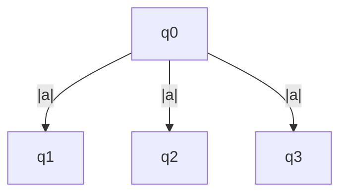

## AUTÔMATO FINITO NÃO DETERMINÍSTICO (AFND ou AFN)
- a função programa de um autômato finito não-determinístico ao processar uma entrada (estado corrente e símbolo lido) tem como resultado um conjunto de novos estados
- exemplo: estado q0 ao processar o símbolo 'a' pode assumir os estados q1,q2 ou qn:
  - notação matemática: $\sigma(q0,a) = {q1,q2,q3}$ 

- assume um conjunto de estados alternativos, como se houvesse uma multiplicação de unidades de controle, uma para cada alternativa, processando independentemente, sem compartilhar recursos.
  - o processamento de um caminho não influi no estado, símbolo lido e posição da cabeça da fita para os demais caminhos alternativos.
  - o processamento de um AFN M para um conjunto de estados, ao ler um símbolo, é a união dos resultados da função programa aplicada a cada estado alternativo
- mesmo que a facilidade do não-determinístico seja aparente ele não aumenta o poder computacional do autômato
- qualque AFN pode ser simulado por um AFD, e ao contrário também
- **definição:** autômato finito não-determinístico é um 5-upla:  M = { $\sum$, Q, $\sigma$, q0, F}, em que:
  - $\sigma$ é a função programa ou função de transição. $\sigma: Qx \sum  🡺 2 ^Q$
- exemplo 01:
  - L ={W ∈ {a,b}* | W possui aa ou bb como subpalavra}
  - M = ({a,b},{q0,q1,q2,q3}, $\sigma$,q0,{q3})
  - tabela: 
    - | $\sigma$| a | b |
      |:---:|:---:|:---:|
      | q0 | {q0,q1}| {q0,q2}|
      | q1 | {q3} | - |
      | q2 | - | {q3} |
      | q3 | {q3} | {q3} |
  - grafo:
    - ```mermaid
        graph LR;
          q0--|a|--> q1;
          q0--|b|--> q2;
          q0--|a,b|--> q0;
          q1--|a|--> q3;
          q2 --|b|--> q3;
          q3 --|a,b|--> q3;
      ```

---
#### minhas anotações
- um mesmo estado tem transição para dois estados diferentes utilizando um mesmo caractere do alfabeto
- para ele aceitar uma palavra pelo menos um dos caminhos tem que aceitar a palavra, mas pode ter caminhos que não são aceitos
- na representação da função programa o resultado é um conjunto de estados
---
