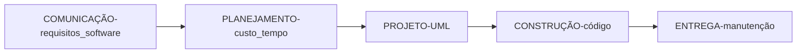

# PROJETO DE SOFTWARE
## Competências da disciplina
### unidade 01
- lembrar os aspectos fundamentais de projeto de software aplicados a projetos de sistemas computacionais de forma crítica
### unidade 02
- compreender a arquitetura e padrões de projeto de software aplicados a projetos de sistemas computacionais de forma profissional
### unidade 03
- aplicar os conceitos e padrões de projeto de software no desenvolvimento de sistemas computacionais de forma crítica 
### unidade 04
- criar com padrão MVC e uma metodologia de ágil o desenvolvimento de um software moderno de forma profissional
### provas
- unidade 1 + unidade 2 = prova teórica + entregas
- unidade 3 = prova prática + entregas
- unidade 4 = trabalho final ➜ continuação do projeto do museu do 4º semetre
### linguagens 
- java sprig + thymeleaf + MySQL + JPA
---
### revisão - engenharia de software
- software = conjunto de instruções + dados + documentação ➜ produto desenvolvido por programadores
- engenharia = desenvolver um produto de forma metódica  ➜ **processo** (seguir passos) de construção de um projeto

- cliclo de vida de desenvolvimento de software ou metodologia de desenvolvimento ➜ como organiza o processo para construção do software
--- 
### atividade
- programa de cadastro de produtos utilizando Java com interface grafica e armazenamento em arquivo csv
