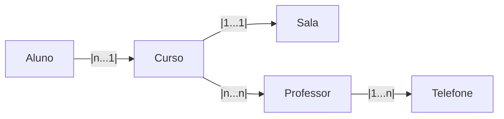

# Spring JPA (Java Persistence API)
- Mapeamento Objeto Relacional - ORM (Object-Relational Mapping) 

- fornece um conjunto de conceitos e diretrizes que implementam diretamente como gerenciar dados relacionais em aplicativos Java. Metadados de anotações são fornecidos pelo JPA para definir uma relação entre objetos e bancos de dados relacionais.

### ➥ JPA Annotation
A anotação é uma informação suplementar sobre o programa, são usadas no mapeamento de objetos Java para tabelas de banco de dados. O Hibernate é a biblioteca ORM mais popular que utiliza as especificações JPA e fornece algumas anotações adicionais. As anotações podem ser adicionadas ao código-fonte e permitidas a serem retidas pelo JVM em tempo de execução.


| Anotação          | Finalidade                                          |
| ----------------- | --------------------------------------------------- |
| `@Entity`         | Define uma classe como entidade JPA                 |
| `@Table`          | Define o nome da tabela e ermite definir informações adicionais sobre a tabela associada à entidade.                             |
|`@Column`          |Permite definir informações adicionais sobre a coluna associada ao campo. |
| `@Id`             | Define a chave primária                             |
| `@GeneratedValue` | Gera automaticamente o valor da chave               |
| `@ManyToOne`      | Relacionamento muitos-para-um                       |
| `@OneToOne`       | Relacionamento um-para-um                           |
| `@OneToMany`      | Relacionamento um-para-muitos                       |
| `@ManyToMany`     | Relacionamento muitos-para-muitos                   |
| `@JoinColumn`     | Define a coluna de chave estrangeira e permite definir informações adicionais sobre a coluna que é usada para a junção de entidades em relacionamentos.             |
| `@JoinTable`      | Define a tabela intermediária                       |
| `@Embedded`       | Incorpora uma classe dentro de uma entidade         |
| `@Embeddable`     | Define uma classe incorporável                      |
| `@EmbeddedId`     | Define uma chave primária composta incorporada      |
| `@MapsId`         | Liga um relacionamento a um campo da chave composta |
| `@Lob`            |  Indica que o campo contém um objeto grande (Large Object), como um blob ou clob. |

--- 
### ➥ JPA para M.O.R em relacionamento unidirecional
Relacinamentos unidirecionais são associações entre entidades em que apenas uma classe conhece a outra  


``` java
    //Classe Curso
    @Entity 
    public class Curso {
        @Id
        @GeneratedValue(strategy = GenerationType.IDENTITY)
        private int id;
        private String nome;
        private String descricao;
        private int cargaHoraria;

        @OneToOne
        @JoinColumn(name="sala_id")

        private Sala sala;
        @ManyToMany
        @JoinTable(
                name="curso_professor",
                joinColumns = @JoinColumn(name="curso_id"),
                inverseJoinColumns = @JoinColumn(name="professor_id") /
        ) 
        private List<Professor> professores;
    }

    // Classe Aluno
    @Entity
    @Table (name="Estudantes") 
    public class Aluno {
        @Id 
        @GeneratedValue(strategy = GenerationType.IDENTITY)
        private int id;
        private String nome;
        @Column(unique=true, nullable=false)
        private String cpf;
        @Column(unique=true, nullable=false)
        private String email;

        @ManyToOne
        @JoinColumn(name="curso_id") 
        private Curso curso;
    }

    // Classe Professor
    @Entity
    public class Professor {
        @Id
        @GeneratedValue(strategy = GenerationType.IDENTITY)
        private int id;
        private String nome;
        private String email;
        private String especialidade;

        @OneToMany(cascade = CascadeType.ALL)
        @JoinColumn(name = "professor_id")
        private List<Telefone> telefone;
    }

    //Classe Sala
    @Entity
    public class Sala {
        @Id
        @GeneratedValue(strategy = GenerationType.IDENTITY)
        private int id;

        private int numero;
        private SalaTipo tipo;
    }

    // Enumerador Sala Tipo
    public enum SalaTipo {
        LABORATORIO,AUDITORIO,NORMAL;
    }

    // Classe Telefone
    @Entity
    public class Telefone {
        @Id
        @GeneratedValue(strategy = GenerationType.IDENTITY)
        private int id;
        private String numero;
        private String tipo;
    }
```

- ManyToOne
    - Aluno e Curso ➜ muitos alunos pertencem a um curso
        - como em geral 'quem está com o n guarda a chave estrangeira' a classe Aluno terá o atributo referente ao curso.  
        - dessa forma o a tabela aluno no banco de dados ficará: id | nome | email | curso_id


- OneToOne
    - Curso e Sala ➜ cada curso tem uma sala
    - sempre que for 1...1 verificar se dá para juntar as informações em apenas uma tabela
        - nesse caso não tem como pois sala tem atributos independentes
    - nesse relacionamento não faz diferença quem ficará com a chave estrangeira   

- OneToMany
    - Telefone e Professor ➜ um telefone pertence a um professor mas um professor pode ter muitos telefones
    - como o 'n' está do lado com o professor a classe professor conterá um list com os telefones vindos da classe Telefone

- ManyToMany
    - Curso e Professor ➜ um curso possui muitos professores e um professor pode estar em muitos cursos
    - sempre em relacionamentos n...n tem que ter uma entidade para guardar a chave 
        - *cuidado* a chave primaria da entidade será a combinação das duas chaves primarias o que a torna fraca
    - como é n...n não faz diferença com quem fica a chave
        - quem ficar com chave estrangeira deverá ter uma lista referente a outra classe

- @Embedded e @Embeddable
    - é usada em Java para indicar que uma entidade possui um objeto incorporado. Isso significa que os campos do objeto incorporado devem ser mapeados para colunas na tabela do banco de dados da entidade pai.
    - por exemplo:
        - se aluno  tivesse um campo endereço (@Embedded), endereço  poderia ser uma classe Endereço (@Embeddable) com os atributos referentes a endereço como rua, numero, bairro,... mas essa classe não seria uma entidade própia, ela seria incorporada dentro da tabela aluno    
    - O uso de @EmbeddedId exige que a classe da chave composta:
        - seja anotada com @Embeddable;
        - implemente Serializable;
        - possua construtor vazio;
        - possua equals() e hashCode();
        - represente corretamente os campos da chave primária composta.


- personalização de colunas com @AttributeOverrrides
    - Caso seja necessário alterar os nomes das colunas do objeto incorporado:

``` java
@Embedded
@AttributeOverrides({
    @AttributeOverride(name = "rua", column = @Column(name = "endereco_rua")),
    @AttributeOverride(name = "numero", column = @Column(name = "endereco_numero")),
    @AttributeOverride(name = "bairro", column = @Column(name = "endereco_bairro")),
    @AttributeOverride(name = "cidade", column = @Column(name = "endereco_cidade")),
    @AttributeOverride(name = "estado", column = @Column(name = "endereco_estado")),
    @AttributeOverride(name = "cep", column = @Column(name = "endereco_cep"))
})
private Endereco endereco;
```

