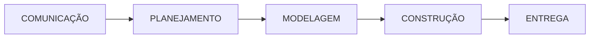
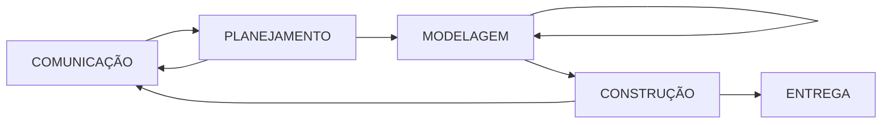
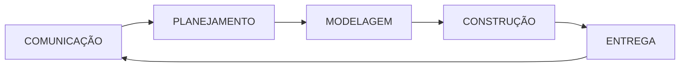

# Modelos de Processo
- "roteiro" que ajuda a criar um resultado de alta qualidade e dentro do prazo estabelecido
- os engenheiro de sofwatre e gerentes adaptam o processo às suas necessidades
- propicia estabilidade, controle e organização para uma atividade
- artefatos:
  -  produto de trabalho = programas, documentos e dados produzidos em consequência das atividades definidas pelo processo
- qualidade, cumprimento de prazos e viabilidade a longo prazo ➔ indicadores de eficácia do processo utilizado

### Modelo de Processo Genérico
- 5 atividades metodológicas:
  - comunicação
  - planejamento
  - modelagem
  - construção
  - entrega
### Fluxos de Processos
- **Linear** ➔ executa cada uma das atividades em sequência

- **Interativo** ➔ repete uma ou mais das atividades antes de proseguir para a seguinte

- **Evolucionário** ➔ Executa as atividades de uma forma circular, cada volta conduz a uma versão mais completa do software

